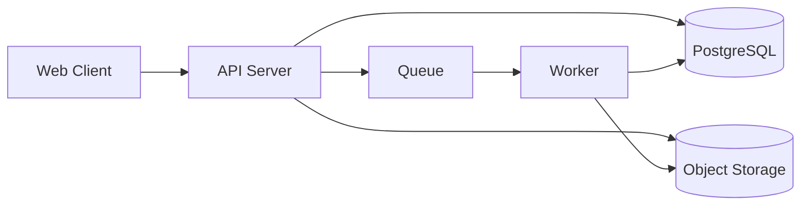

# 아키텍처 다이어그램 (AA)

## 구성 요소
- Web Client
- API Server
- Worker(비동기 처리)
- DB(PostgreSQL)
- Object Storage(오디오/결과 파일)
- Queue(Redis 또는 메시지 큐)

## Mermaid Diagram

## 설계 원칙
- API 서버는 요청 검증/오케스트레이션 중심
- 무거운 처리(전사/요약)는 Worker 분리
- 저장소와 DB 책임 분리

## 개발 전 확정 필요 항목
- Worker 수평 확장 기준
- Queue 재시도 정책
- 장애 복구 절차(RPO/RTO)
