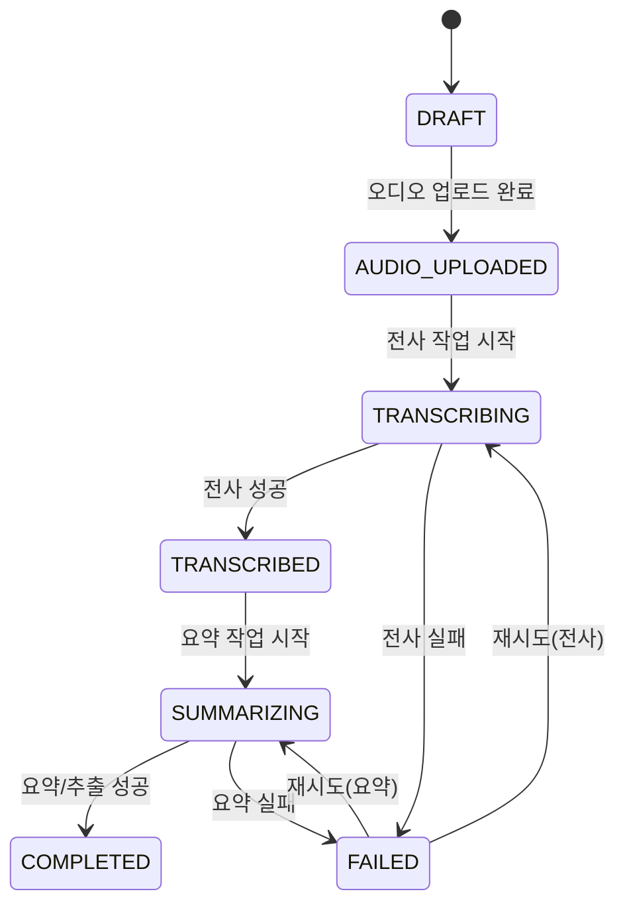

# 상태 흐름도 (AA)

## 회의 처리 상태
- DRAFT
- AUDIO_UPLOADED
- TRANSCRIBING
- TRANSCRIBED
- SUMMARIZING
- COMPLETED
- FAILED

## Mermaid State Diagram

## 상태 전이 규칙
- 전사 완료 전 요약 시작 불가
- FAILED 상태에서는 실패 원인 코드 저장 필수
- COMPLETED 이후 수정은 재처리 작업으로만 허용
