[전체 프로젝트](../README.md) | [AA (Frontend)](../AA/README.md) | [TA (Backend)](../TA/README.md) | **SA (AI Pipeline)**

# SA 작업 증적 (AI Processing Pipeline)

## 1) 프로젝트 개요

AI Minutes(MeetUs) 프로젝트는 사용자가 회의 음성 파일을 업로드하면 전사, 요약, 결정사항, 개인별 To-Do를 자동 생성하고 아카이브하는 서비스다.

전체 구조는 프론트엔드, Core API, AI 처리 파이프라인, 데이터 저장소, AWS 배포 리소스로 나뉜다.

- 프론트엔드(AA)는 업로드, 목록, 상세 조회 화면을 제공한다.
- Core API(TA)는 회의 생성, 업로드 제어, 상태 관리, 결과 조회를 담당한다.
- **AI 처리 파이프라인(SA)은 음성 데이터를 STT 변환하고 LLM을 통해 요약/To-Do를 추출한다.**
- 데이터 저장소는 회의 메타데이터와 결과 데이터를 보관한다.
- AWS 리소스는 서비스 배포, 라우팅, 저장, 로그 수집을 담당한다.

---

## 2) SA 담당 범위

### 2.1 목표

- AWS Managed AI 서비스(Transcribe, Bedrock) 연동 경험
- SQS 기반 비동기 이벤트 파이프라인 설계 및 구축
- ECS Fargate 컨테이너 배포 및 Rolling Update 무중단 배포 경험
- OIDC 기반 Keyless CI/CD 파이프라인 구축
- 최소 권한 원칙(Least Privilege) IAM 보안 설계

### 2.2 수행 내용

- AI 파이프라인 핵심 로직(STT/LLM) 모듈화 개발
- SQS Long Polling 기반 비동기 메시지 수신 구조 구축
- Core API Webhook 연동 (결과 전달 / 실패 통보)
- 크로스 계정(Cross-Account) S3 접근 권한 설계
- Docker 이미지 빌드 및 ECS Fargate 배포
- GitHub Actions + OIDC CI/CD 자동 배포 구축
- SA 전용 IAM 최소 권한 정책 설계

---

## 3) 기술 스택

### 3.1 언어 및 런타임

<strong>Python 3.12</strong> AI 파이프라인 전체 코드 개발에 사용된다.

<strong>Boto3</strong> AWS 서비스(SQS, Transcribe, Bedrock, S3) 연동에 사용된다.

<strong>Requests</strong> Core API 서버와의 HTTP 통신에 사용된다.

### 3.2 AI 서비스

<strong>AWS Transcribe</strong> 회의 음성 파일(m4a)을 한국어 텍스트로 변환(STT)하는 데 사용된다.

<strong>Amazon Bedrock (Claude 3.5 Sonnet)</strong> 변환된 텍스트를 기반으로 회의 요약 및 개인별 To-Do를 JSON 형태로 추출하는 데 사용된다.

### 3.3 인프라 및 배포

<strong>AWS SQS</strong> 비동기 메시지 큐로, AI 처리 작업 지시를 수신(Long Polling)하는 데 사용된다.

<strong>AWS ECS (Fargate)</strong> AI 파이프라인 컨테이너 실행 환경으로 사용된다.

<strong>AWS ECR</strong> AI 파이프라인 Docker 이미지를 저장하는 레지스트리다.

<strong>Docker</strong> AI 파이프라인 코드를 컨테이너 이미지로 패키징하는 데 사용된다. (`python:3.12-slim` 기반)

<strong>CloudWatch Logs</strong> AI 파이프라인 컨테이너 로그 수집에 사용된다.

### 3.4 보안 및 CI/CD

<strong>GitHub Actions</strong> 코드 Push 시 자동으로 Docker 빌드, ECR Push, ECS 배포를 수행한다.

<strong>OIDC (OpenID Connect)</strong> GitHub Actions에서 AWS에 Keyless 인증을 하는 데 사용된다. 영구 Access Key 미사용.

<strong>Rolling Update</strong> ECS Fargate 서비스의 무중단 배포 전략으로 사용된다.

---

## 4) AI 파이프라인 아키텍처

### 4.1 전체 구조

```
SQS (Queue) -> sqs_listener (Main) -> stt_processor -> llm_processor -> api_client (Core API 전달)
```

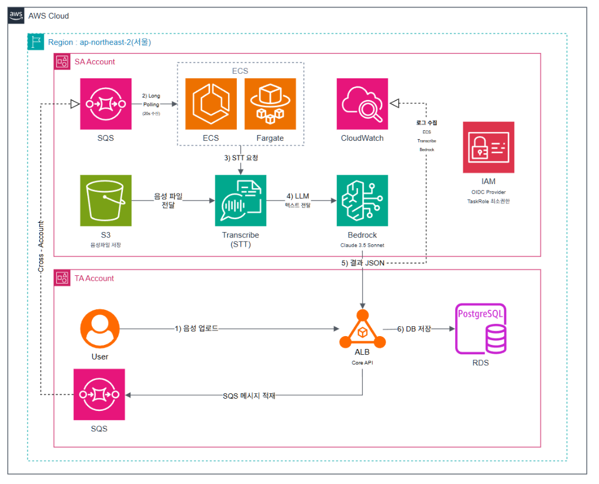

### 4.2 요청 흐름 (1-Cycle)

1. 프론트/백엔드에 의해 AWS SQS 대기열에 '새로운 음성이 업로드 됨' 메시지가 적재된다. (상태: `UPLOADED`)
2. `sqs_listener.py`는 24시간 백그라운드로 돌면서 20초 주기(Long Polling)로 메시지를 수신한다.
3. `stt_processor.py`가 AWS Transcribe에 음성 S3 주소를 넘겨 전체 텍스트를 받아온다. (S3 URI 자동 보정 로직 포함)
4. 변환된 텍스트를 `llm_processor.py`가 Amazon Bedrock (Claude 3.5 Sonnet)으로 던져 JSON 포맷(요약 및 To-Do)으로 리턴받는다.
5. `api_client.py`가 최종 결과를 백엔드 Core API의 웹훅(`POST /internal/ai/result`)으로 전송한다.
6. 에러 없이 5번이 끝나면 SQS에서 메시지를 안전하게 삭제한다(Ack).

### 4.3 디렉토리 구조

```text
ai-pipeline/
├── Dockerfile            # Docker 배포 이미지 (python:3.12-slim)
├── .dockerignore         # 불필요 파일 제외
├── requirements.txt      # Python 패키지 의존성 (boto3, requests)
├── src/
│   ├── config.py         # 모든 .env 환경변수를 중앙 제어하는 파일
│   ├── sqs_listener.py   # 메인 엔진 (24시간 SQS 모니터링 데몬)
│   ├── local_test.py     # 외부 과금 없는 단위 테스트(Mock) 파일
│   ├── core/
│   │   ├── stt_processor.py  # AWS Transcribe 호출
│   │   └── llm_processor.py  # AWS Bedrock 호출 (Prompt Engineering)
│   ├── network/
│   │   └── api_client.py     # 백엔드 Core API REST 통신 모듈
└── docs/                 # 설계, 기능 명세 및 플레이북 문서
```

---

## 5) 핵심 구현 로직

### 5.1 SQS Long Polling (`sqs_listener.py`)

파이프라인의 심장부. AWS SQS를 24시간 `WaitTimeSeconds=20` 롱 폴링으로 감시하며, 메시지가 도착하면 STT → LLM → API 모듈을 순서대로 지휘한다.

- **비용 최적화:** Short Polling 대비 API 호출 횟수 대폭 절감
- **에러 격벽:** Try-Except 구조로 개별 메시지 실패가 전체 리스너를 죽이지 않음
- **재시도:** 처리 실패 시 SQS 특성에 의해 자동 재시도 (최대 3회 후 FAILED 웹훅 발송)

### 5.2 음성→텍스트 변환 (`stt_processor.py`)

AWS Transcribe를 통해 m4a 음성을 한국어 텍스트로 변환한다.

- **크로스 계정 접근:** TA 계정의 S3 버킷에 접근하기 위해 `DataAccessRoleArn` 설정
- **S3 URI 자동 보정:** `s3://` 접두사 누락 시 자동 보정 로직 내장
- **Polling 방식:** 5초 간격으로 상태 확인하여 `COMPLETED`/`FAILED` 감지

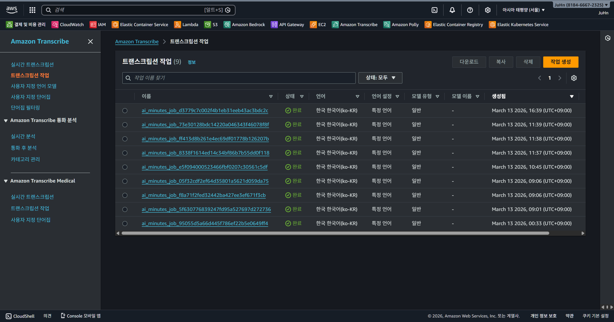

### 5.3 AI 요약 및 To-Do 추출 (`llm_processor.py`)

Amazon Bedrock (Claude 3.5 Sonnet)에 프롬프트 엔지니어링을 적용하여 정형화된 결과를 추출한다.

- **출력 포맷:** 요약(5~7줄) + 결정사항 + To-Do 배열(`assignee`, `task`, `due_date`)
- **JSON 강제:** 프롬프트에서 JSON만 반환하도록 지시하여 파싱 안정성 확보
- **실패 대응:** JSON 파싱 실패 시 SQS 재시도 매커니즘 활용

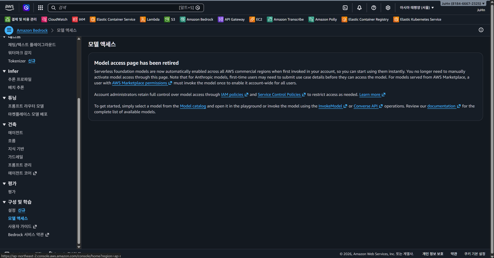

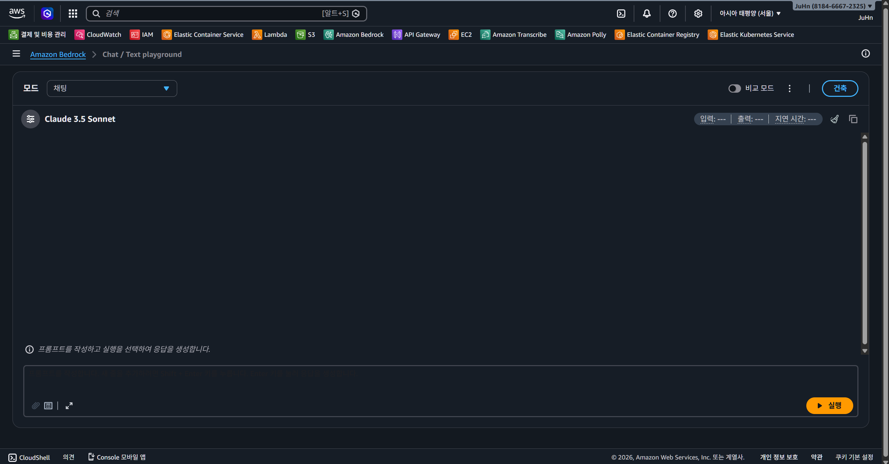

> **참고:** 프로젝트 개발 시점에는 Bedrock 콘솔의 Model Access 페이지에서 Claude 3.5 Sonnet 사용 권한을 별도로 신청하여 승인받았으나, 현재는 AWS 정책 변경으로 해당 페이지가 폐지(retired)되어 모든 Foundation Model이 자동 활성화되었다.

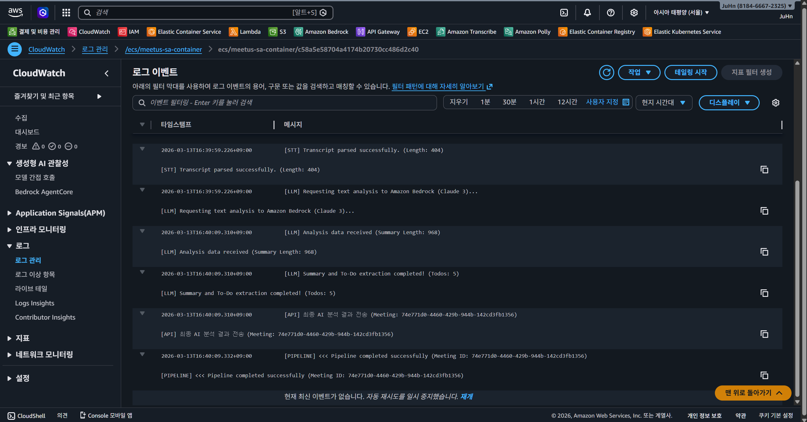

### 5.4 결과 전달 (`api_client.py`)

AI 분석 결과를 Core API 웹훅으로 전송하는 통합 통신 모듈이다.

- **성공 시:** `POST /internal/ai/result` — transcript, summaries, todos JSON 전달
- **실패 시:** `POST /internal/ai/failed` — meeting_id, reason 전달
- **Timeout 정책:** 모든 요청에 `timeout=10` 제한

---

## 6) 배포 구조 (CI/CD)

### 6.1 SA CI/CD 흐름

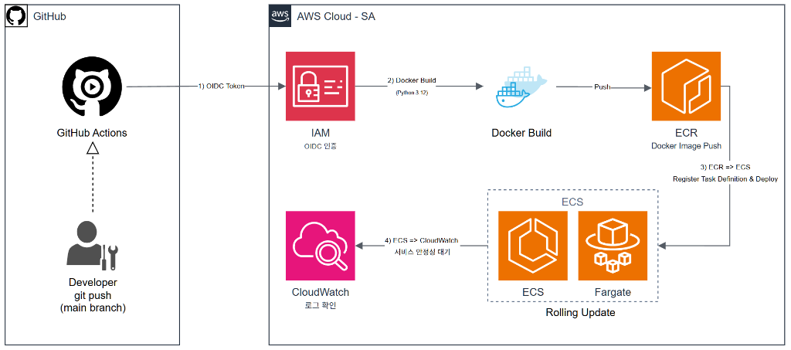

1. SA 담당자가 `ai-pipeline/` 폴더에 코드를 변경하고 GitHub `main` 브랜치에 푸시한다.
2. GitHub Actions가 실행된다. (`deploy-sa.yml`)
3. OIDC를 통해 AWS IAM에 단기 토큰을 제출하며 `MeetUs-SA-GitHubActionRole`을 임시 사용한다.
4. Docker 이미지가 `python:3.12-slim` 기반으로 빌드되고 ECR에 업로드된다.
5. ECS가 새로운 Task Definition을 수신하여 새 컨테이너를 실행한다.
6. 새 컨테이너가 정상 실행되면 ECS가 이전 컨테이너를 자동 중지한다. (Rolling Update)

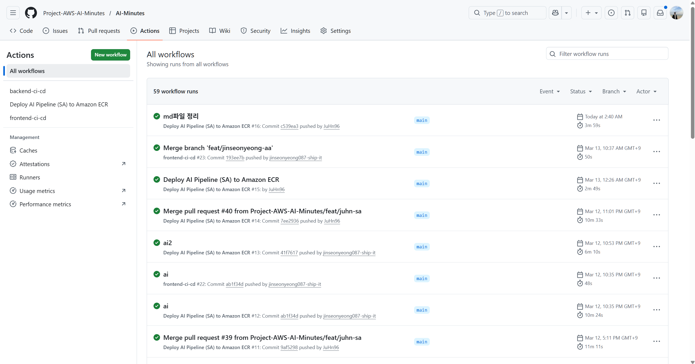

### 6.2 Rolling Update 채택 사유

| 비교 항목 | Blue-Green (FE/BE) | Rolling Update (SA) |
|---|---|---|
| 트래픽 | ALB를 통한 사용자 직접 요청 | SQS 폴링 (외부 트래픽 없음) |
| 배포 중 영향 | 무중단 필수 | 메시지는 SQS에 보관되어 유실 없음 |
| 추가 비용 | CodeDeploy + Target Group 2개 | 추가 비용 없음 |
| 적합 이유 | 사용자 대면 서비스 | 비동기 백그라운드 Worker |

### 6.3 배포 관련 산출물

- [ai-pipeline/Dockerfile](../ai-pipeline/Dockerfile)
- [deploy/taskdef-sa.template.json](../ai-pipeline/deploy/taskdef-sa.template.json)
- [.github/workflows/deploy-sa.yml](../.github/workflows/deploy-sa.yml)

---

## 7) 보안 설계

### 7.1 OIDC (OpenID Connect) — Keyless 인증

기존 IAM Access Key 영구 발급 방식 대신, GitHub 자체를 AWS IAM의 Identity Provider로 등록하여 배포 시에만 유효한 단기 토큰을 주고받는 방식을 도입했다.

- **보안 효과:** 키 탈취 시 비트코인 채굴 등 크리티컬한 사고 방지
- **적용 대상:** GitHub Actions → AWS IAM Role (`MeetUs-SA-GitHubActionRole`)

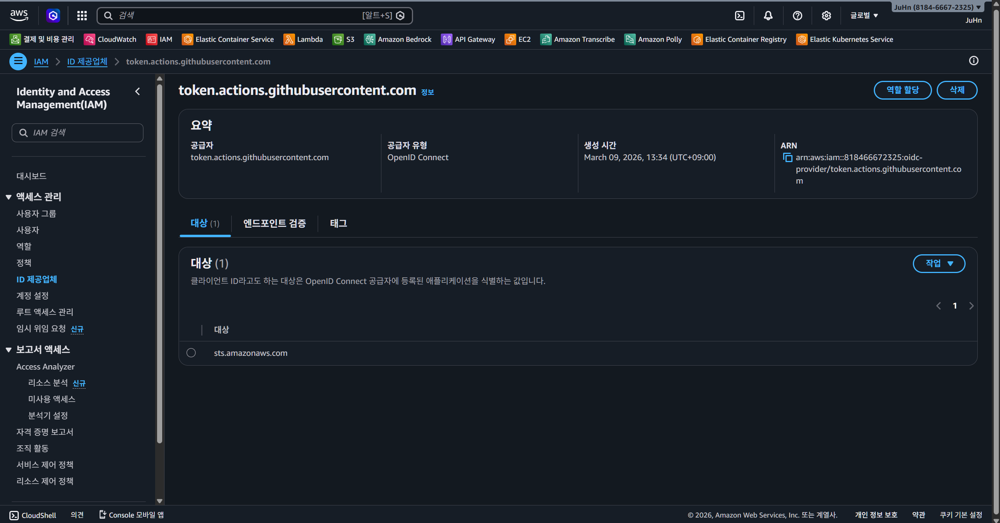

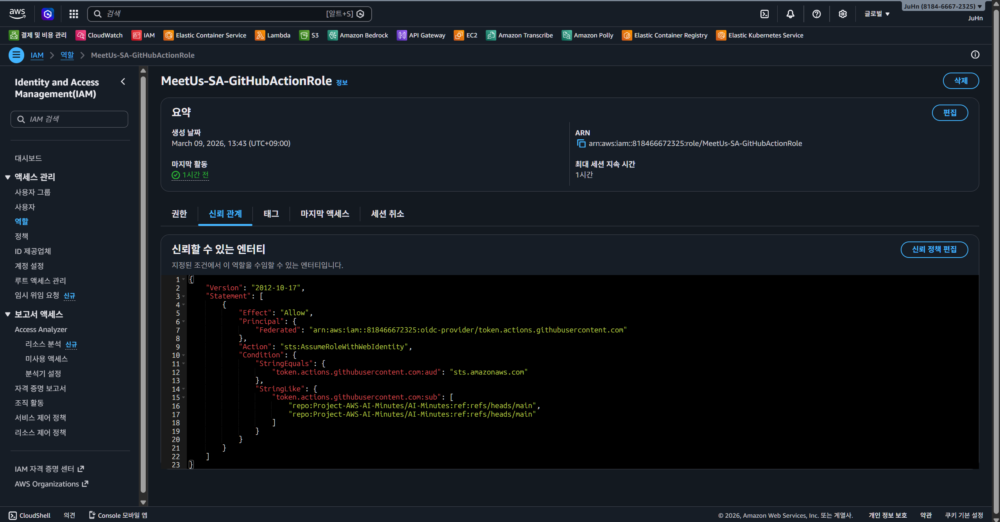

### 7.2 최소 권한 원칙 (Least Privilege)

SA 도커 환경이 해킹당하더라도 피해를 최소화하기 위해, ECS Task Role에 필요한 최소 권한만의 IAM 정책을 인라인으로 설계했다.

- **정책 파일:** [iam_policy_least_privilege.json](../ai-pipeline/docs/iam_policy_least_privilege.json)
- **허용 범위:** SQS 수신/삭제, S3 읽기, Transcribe 작업, Bedrock 호출만 허용

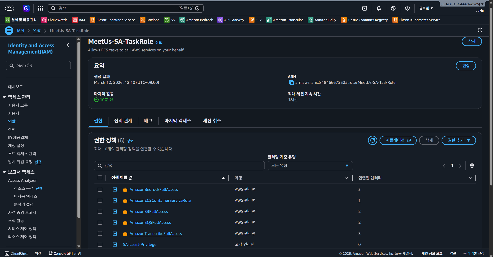

---

## 8) AWS 인프라 구축 증적

SA 파트가 직접 구축한 AWS 인프라 자산과 배포 결과를 정리한다.

### 8.1 ECR (Docker 이미지 저장소)

AI 파이프라인 코드를 `python:3.12-slim` 기반으로 빌드하여 ECR에 푸시했다.

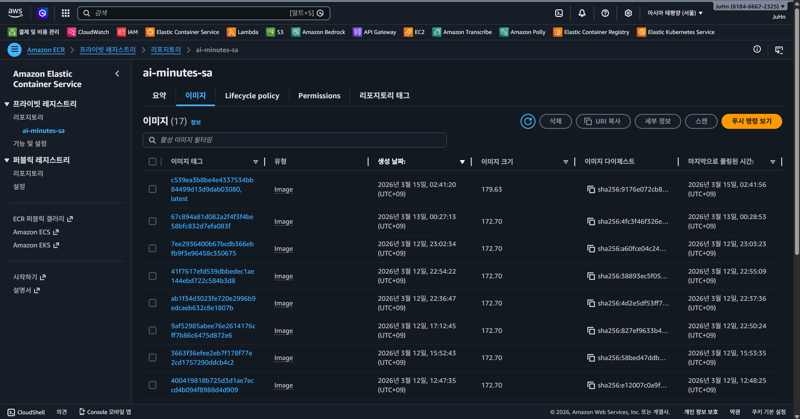

### 8.2 ECS Cluster & Service (컨테이너 실행 환경)

ECS Fargate 기반으로 SA 전용 클러스터를 생성하고 서비스를 구동했다.

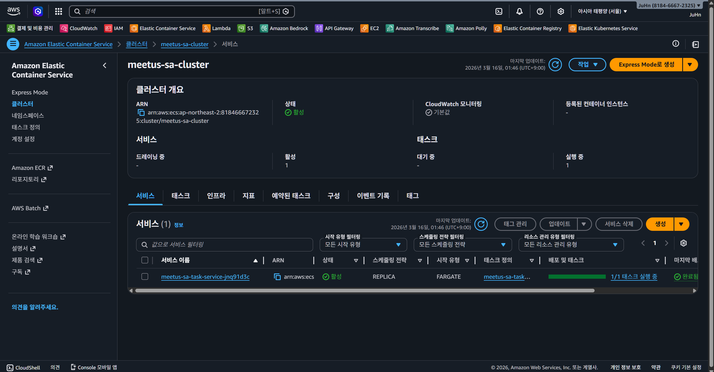

### 8.3 ECS Task Definition (컨테이너 설정)

Task Definition에 컨테이너 이미지, 환경변수, IAM Role, 로그 설정을 등록했다.


### 8.4 IAM Role & OIDC (보안 인증)

GitHub Actions가 AWS에 안전하게 접근할 수 있도록 OIDC Provider를 등록하고 전용 Role을 생성했다.


### 8.5 AWS Transcribe (음성 변환)

실제 회의 음성 파일이 Transcribe Job으로 처리된 기록이다.


### 8.6 Amazon Bedrock (AI 요약 모델)

Claude 3.5 Sonnet 모델에 대한 접근 권한을 활성화한 기록이다.


### 8.7 SQS (메시지 큐)

비동기 AI 처리 작업 지시를 수신하는 큐 기록이다.

> **참고:** SQS(`meetus-process-queue`)는 TA 파트 계정에서 생성 및 관리하며, SA는 Cross-Account 권한을 통해 메시지를 수신한다.

### 8.8 CloudWatch Logs (로그 모니터링)

AI 파이프라인 컨테이너의 실행 로그가 수집된 기록이다.


### 8.9 GitHub Actions (자동 배포)

코드 Push만으로 Docker 빌드부터 ECS 배포까지 자동 수행되는 기록이다.


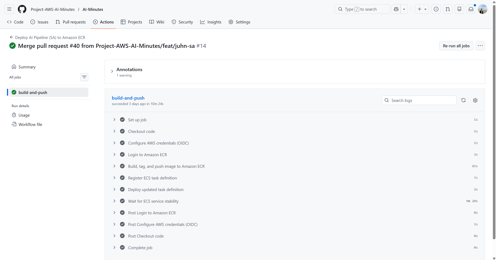

### 8.10 실제 배포 결과 요약

| 항목 | 값 |
|---|---|
| AWS Region | `ap-northeast-2` |
| AWS Account ID | `818466672325` |
| ECS Cluster | `meetus-sa-cluster` |
| ECS Service | `meetus-sa-task-service-jnq91d3c` |
| ECR Repository | `ai-minutes-sa` |
| Core API Base URL | `http://meetus-alb-858165370.ap-northeast-2.elb.amazonaws.com` |

---

## 9) 트러블슈팅

### 9.1 GitHub Secrets 및 IAM 키 보안 위협 방지

- **문제:** IAM Access Key 영구 발급 방식의 보안 위험
- **조치:** OIDC 단기 자격 증명으로 전환하여 클라우드 보안성 고도화

### 9.2 AWS Cross-Account 접근 권한

- **문제:** SQS 큐 및 S3 버킷이 TA 계정에 위치하여 기본적으로 접근 불가 (Access Denied)
- **조치:** TA 담당자에게 SA 계정 ID(`818466672325`)를 전달하여 정책에 화이트리스트 등록

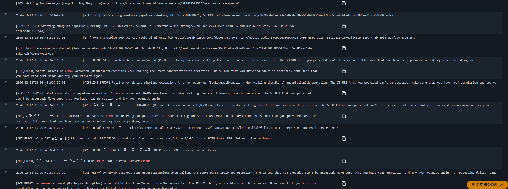

### 9.3 ECR 네트워크 및 헬스체크 타임아웃

- **문제:** `unable to pull secrets or registry auth` 에러, `Target Group Unhealthy`로 무한 재시작
- **조치:** 퍼블릭망 아웃바운드 검증 및 ECS Task 전용 보안 그룹에 ALB 인바운드 허용

### 9.4 DB 요약 텍스트 길이 초과

- **문제:** Bedrock이 생성한 요약문 길이가 `varchar(255)` 초과
- **조치:** DB Column을 `TEXT` 타입으로 마이그레이션하여 데이터 유실 방어

### 9.5 도커 환경변수 파싱 오류

- **문제:** `.env` 파일에서 등호 주변 공백으로 인한 `invalid env file` 크래시
- **조치:** 환경변수 할당 규격(`KEY=VALUE`)에 맞춰 공백 제거

### 9.6 ECS Task Definition 로그 그룹 불일치

- **문제:** 배포 성공 후 로그 미생성 또는 Task 즉시 종료
- **조치:** `awslogs-group` 이름 및 컨테이너 이름을 실제 인프라와 1:1 매칭

### 9.7 iam:PassRole 권한 부족

- **문제:** 서비스 업데이트 시 `AccessDenied` 에러
- **조치:** OIDC Role에 `iam:PassRole` 권한 추가 및 워크플로우에 `services-stable` 대기 단계 도입

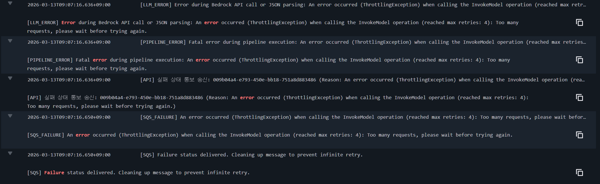

---

## 10) 산출물 목록

### 10.1 SA 전용 문서
- [SA 파이프라인 시스템 설계](./sa-system-design.md)
- [SA API 연동 규격](./api-integration.md)
- [SA 인프라 배포 구조](./deployment-architecture.md)

### 10.2 ai-pipeline/docs 문서
- [SA 작업 플레이북 (종합)](../ai-pipeline/docs/SA-PLAYBOOK.md)
- [시스템 아키텍처 및 데이터 흐름](../ai-pipeline/docs/ARCHITECTURE.md)
- [시스템 기능 명세서](../ai-pipeline/docs/FEATURES.md)
- [SA 작업 WBS 및 To-Do](../ai-pipeline/docs/SA-Todo.md)
- [IAM 최소 권한 정책](../ai-pipeline/docs/iam_policy_least_privilege.json)

### 10.3 배포 파일
- [ai-pipeline/Dockerfile](../ai-pipeline/Dockerfile)
- [deploy/taskdef-sa.template.json](../ai-pipeline/deploy/taskdef-sa.template.json)
- [.github/workflows/deploy-sa.yml](../.github/workflows/deploy-sa.yml)

### 10.4 공통 문서
- [통합 API 명세](../COMMON/api-specification-integrated.md)
- [시스템 플로우차트](../COMMON/system-flowchart.md)
- [네트워크 구성도](../COMMON/network-topology.md)
- [아키텍처 다이어그램](../COMMON/architecture-diagram.md)

---

## 11) 최종 요약

- SA는 AWS Transcribe(STT)와 Amazon Bedrock Claude 3.5 Sonnet(LLM)을 연동한 **AI 파이프라인 엔진**을 설계하고 구축했다.
- SA는 SQS Long Polling 기반의 **비동기 이벤트 구동 아키텍처**로 서비스 간 결합도를 최소화했다.
- SA는 OIDC Keyless 인증 기반 **GitHub Actions CI/CD**와 **ECS Fargate Rolling Update** 무중단 배포를 구축했다.
- SA는 최소 권한 원칙(Least Privilege) IAM 정책을 직접 설계하여 **컨테이너 보안**을 고도화했다.
- SA는 크로스 계정 접근, DB 타입 변경, 환경변수 파싱 등 **다양한 실전 트러블슈팅**을 경험하고 해결했다.
- AI Minutes 프로젝트는 음성 업로드부터 전사, AI 요약, To-Do 추출, 클라우드 배포까지의 **전체 서비스 파이프라인**을 다루는 프로젝트다.
